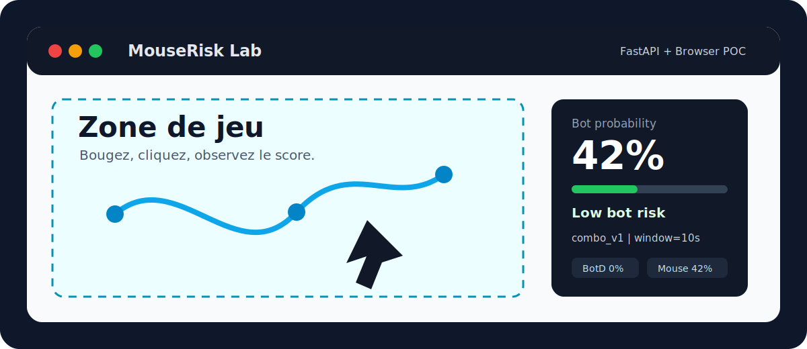
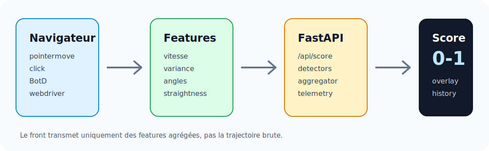
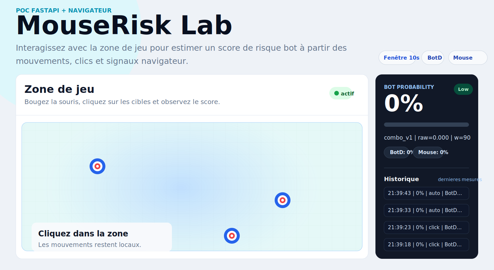

# Bot Risk Game

<p align="center">
  
</p>

<p align="center">
  
  
  
  
  
</p>

**Bot Risk Game** est un POC FastAPI + navigateur qui calcule un score de risque bot entre `0` et `1` pendant une interaction de jeu.  
Le score combine des signaux d'automatisation du navigateur avec une heuristique sur la dynamique souris/pointeur.

> Ce projet produit un score probabiliste. Il sert à déclencher de la friction ou du monitoring, pas à bannir automatiquement un utilisateur.

## Aperçu

| Fonction | Détail |
| --- | --- |
| Score temps réel | Recalcul au clic et rafraîchissement automatique en idle |
| Fenêtre glissante | Analyse des mouvements et clics sur les 10 dernières secondes |
| Multi-signaux | BotD, `navigator.webdriver`, plugins, langues, vitesse, trajectoire, régularité |
| Privacy-by-design | Le front envoie des features agrégées, pas la trajectoire brute |
| Sans entraînement | Pas de dataset, pas de pipeline ML, pas de modèle sauvegardé |

<p align="center">
  
</p>

## Interface

<p align="center">
  
</p>

L'interface affiche la zone de jeu à gauche et un panneau de scoring à droite. Le panneau résume la probabilité de bot, les signaux détectés et les dernières mesures.

## Comment ça marche

1. Le navigateur collecte des événements `pointermove`, `pointerdown`, `pointerup` et `click`.
2. Le script frontend calcule des features agrégées : vitesse moyenne, variance, angles, straightness, ratio d'événements trusted.
3. BotD et quelques signaux d'environnement détectent les contextes d'automatisation.
4. L'API FastAPI reçoit le payload sur `POST /api/score`.
5. L'agrégateur combine les détecteurs et renvoie une probabilité de bot.
6. L'overlay met à jour le pourcentage, le statut et l'historique.

## Installation

```bash
python -m venv .venv
```

Windows :

```bash
.venv\Scripts\activate
```

Linux / macOS :

```bash
source .venv/bin/activate
```

Puis :

```bash
pip install -r requirements.txt
```

## Lancer le projet

```bash
python run_server.py
```

Ou directement avec Uvicorn :

```bash
uvicorn app:app --reload --host 127.0.0.1 --port 8000
```

Ouvrez ensuite :

```text
http://127.0.0.1:8000
```

## API

| Méthode | Route | Description |
| --- | --- | --- |
| `GET` | `/` | Page de démonstration |
| `GET` | `/api/health` | Healthcheck |
| `POST` | `/api/score` | Score heuristique à partir des features frontend |
| `GET` | `/api/telemetry?session_id=...&limit=...` | Derniers scores en JSON |

Exemple de réponse :

```json
{
  "bot_probability": 0.72,
  "model": "combo_v1",
  "raw_score": 0.72,
  "signals": {
    "mouse_heuristic_v1": {
      "score": 0.41,
      "raw": {}
    },
    "botd_v2": {
      "score": 0.72,
      "raw": {}
    }
  }
}
```

## Test humain automatisé

Installez les dépendances du script :

```bash
pip install -r requirements-test.txt
```

Lancez le script après avoir ouvert la page dans le navigateur :

```bash
python tools/human_mouse_test.py --region 100,200,900,800 --n-clicks 5
```

`REGION` correspond à la zone cliquable du jeu, au format écran `x1,y1,x2,y2`.  
Pour calibrer proprement, utilisez un outil de coordonnées souris et ciblez uniquement la zone de jeu.

## Environnement de test réel

Un lab plus complet est disponible pour comparer plusieurs comportements de souris à l'écran :

```bash
python tools/real_mouse_lab.py --region 100,390,1100,760 --mode human --count 12
python tools/real_mouse_lab.py --region 100,390,1100,760 --mode teleport --count 12
python tools/real_mouse_lab.py --region 100,390,1100,760 --mode grid --count 12
```

Les modes disponibles sont `human`, `linear`, `teleport`, `grid`, `center` et `double`.

Voir [docs/real-test-environment.md](docs/real-test-environment.md) pour la calibration de la zone et l'interprétation des scores.

## Tests automatisés

Installez les dépendances de test :

```bash
pip install -r requirements-test.txt
```

Lancez la suite `pytest` :

```bash
python -m pytest -q
```

Les tests couvrent l'API FastAPI, l'agrégateur, BotD et l'heuristique souris.

## Structure

```text
.
├── app.py                     # API FastAPI et endpoints
├── run_server.py              # Lancement local
├── detectors/
│   ├── aggregator.py          # Combinaison des détecteurs
│   ├── botd_v2.py             # Signal BotD / automation
│   └── heuristic_mouse_v1.py  # Heuristiques souris
├── static/
│   ├── index.html             # Démo navigateur
│   ├── style.css              # Présentation de la page
│   └── bot_risk.js            # Collecte et scoring frontend
├── docs/
│   └── real-test-environment.md
└── tools/
    ├── human_mouse_test.py    # Script de test simple avec pyclick
    └── real_mouse_lab.py      # Lab de mouvements souris réels
```

## Points forts

- Architecture simple à comprendre et à modifier.
- Bon découpage entre interface, API et détecteurs.
- Approche prudente : le projet parle de risque, pas de vérité absolue.
- Bonne base pour ajouter une agrégation temporelle, des seuils métier ou un tableau de bord.

## Limites

- Un bot avancé peut imiter des trajectoires humaines.
- BotD cible surtout Selenium, WebDriver, headless et autres signaux d'automatisation connus.
- Certains environnements verrouillés ou atypiques peuvent créer des faux positifs.
- La cinématique souris reste probabiliste : elle doit être utilisée avec des seuils, du contexte et de la friction progressive.

## Idées d'amélioration

- Ajouter une EMA pour lisser le score dans le temps.
- Stocker la télémétrie dans SQLite pour comparer plusieurs sessions.
- Ajouter des seuils configurables : `low`, `medium`, `high`.
- Afficher un mini graphique d'évolution du score dans l'overlay.
- Ajouter des tests unitaires sur les détecteurs.

